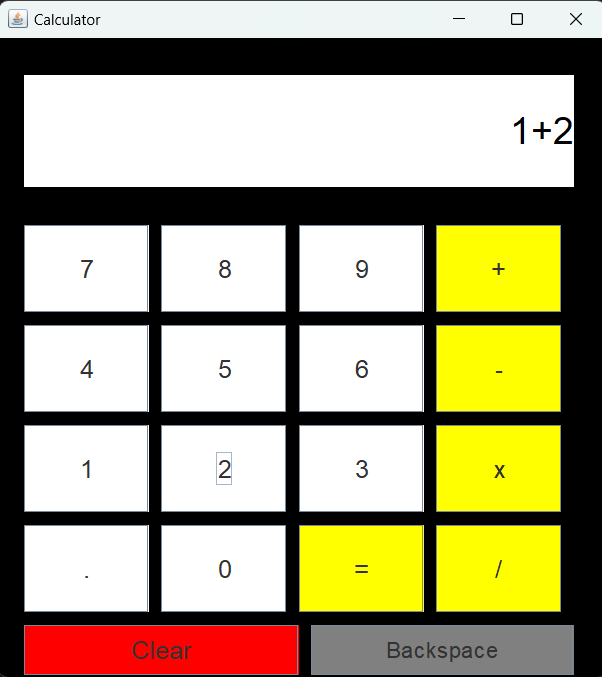

# Basic Calculator 🧮

A simple and clean **Basic Calculator** built using **Java Swing**. This project performs basic arithmetic operations and includes essential features like clear and backspace.

> Repository: [Keerthanak167/CALCULATOR](https://github.com/Keerthanak167/CALCULATOR)

## ✨ Features

- Graphical User Interface (GUI) using Java Swing
- Basic operations:
  - Addition (+)
  - Subtraction (−)
  - Multiplication (×)
  - Division (÷)
- Decimal number input (.)
- Clear button to reset input
- Backspace button to delete the last digit
- Responsive and easy-to-use layout

## 🖼️ Preview

## ⚙️ How to Run

### Option 1: Using Terminal / Command Line
1. Clone the repository:
   git clone https://github.com/Keerthanak167/CALCULATOR.git
   
   cd Calculator
2. Compile and run:

   javac Calculator.java
   
   java Calculator
